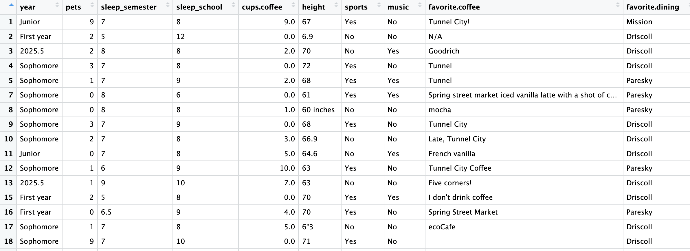

```{r global_options, include=FALSE}
knitr::opts_chunk$set(eval = FALSE)
library(tidyverse)
library(openintro)
```


<div id="boxedtext">

**Learning Objectives**

- Continue practicing with the RStudio interface.
- Do some manipulating and cleaning of our dataset.
- Continue to explore numerical summaries of variables.
- Start to explore relationships between variables.
</div>

## Getting started

I am hoping that everyone worked through at least part of **tutorial 1** (https://anna-neufeld.github.io/tutorials/201_fall25/day1.html), and so today's tutorial has less introductory material.

Today, we are going to revisit the parts of tutorial 1 that we skipped or did not get to, and then we will move into new material.

## Loading packages

On Tuesday, I accidentally skipped a very important part of the tutorial that had to do with loading packages. One reason I skipped it is that it was covered in your pre-class installation instructions. However, I think it is worth going through once in class.

R is an open-source programming language, meaning that users can contribute
packages that make our lives easier, and we can use them for free. Here are three packages that you need for Homework 1. 

- The suite of **tidyverse** packages: for data wrangling and data visualization
- **openintro**: for data and custom functions with the OpenIntro resources
- **tinytex**: you may need this in order to knit an RMarkdown document into a PDF. For example, you need this if you have a Mac and have never installed tex. 

Hopefully you were able to install these packages using ``install.packages()`` using the pre-class instructions. Note that you can check to see which packages (and which versions) are installed by
inspecting the *Packages* tab in the lower right panel of RStudio. If you do not see ``tidyverse``, ``openintro``, and ``tinytex`` in this panel, it means that you need to run the following code from the pre-class instructions. 

```{r install-packages, message = FALSE, eval=FALSE}
install.packages("tidyverse")
install.packages("openintro")
install.packages("tinytex")
tinytex::install_tinytex()
```

Next, regardless of what you completed before class, you need to load these packages in your working environment. We do this with the `library` function. Note that you need to **load** the packages every time you restart RStudio, whereas you only need to **install** the packages once ever. Note that ``tinytex`` is a special case package that we do not need to load: we needed it to make sure we had a Tex installation on our computer, which RMarkdown will need in the background in order to knit to PDFs. 

```{r load-packages, message = FALSE, eval=TRUE}
library(tidyverse)
library(openintro)
```

If anyone does not yet have these packages, you should let me know ASAP for Homework 1. You only need the ``openintro`` package to access the dataset, so I can always just post the dataset for you separately on GLOW. But the ``tidyverse`` package is really necessary for this course, and so I would love to troubleshoot ``tidyverse`` issues ASAP. 

## Loading our data and continuing to explore the class survey data

Let's load the same class form dataset that we used on Tuesday. As a reminder, I posted this dataset on my github website for maximum convenience, and you can load it with the following code. If you are working in an RMarkdown file, make sure to load the tidyverse in this file as well. 

```{r}
library(tidyverse)
form_data <- read.csv("https://anna-neufeld.github.io/tutorials/201_fall25/form_data_anonymous.csv")
```

Here are our goals for today. 

<div id="boxedtext">

**Goals:**

- How do we extract individual elements from a dataset?
- How do we "clean" a dataset?
- How do we numerically and visually explore one numerical variable, one categorical variable, or the relationship between one numerical variable and one categorical variable?
</div>

# Extracting elements from a dataset

You should all now have something called ``form_data`` in your environment. If you double click on it, you should see something like this: 



While this is a useful first look at our data (we diagnosed some problems with the data by looking at this on Tuesday), it is generally going to be overwhelming to try to look at an entire dataset at once. This means that it will be useful to learn how to *extract* individual elements in a dataset. 

There are generally many ways to do a single thing in R. You all saw last class that the following four lines of code all do essentially the same thing: they extract the ``pets`` variable from the ``form_data`` dataset for us. Note that the last two lines will not work unless you have already run ``library(tidyverse)`` (and included this line in your .Rmd document, if you hope to knit this document later). 

```{r}
form_data$pets
form_data[,2]
form_data %>% pull(pets)
form_data %>% select(pets)
```

**Bonus:** Can you figure out which command above is not like the others? What makes it different?

In general, we are going to prefer ``tidyverse`` methods in this class. So, when you want to extract a column from a dataset, it's nice to use ``select()`` or ``pull()``. We like ``tidyverse`` methods because they can easily be combined with one another, as we will see below. 

When we want to select a subset of *observations* (rows) from a dataset, we use ``filter()``. The following code displays only the data for students who play a sport at Williams. 

```{r, eval=F}
form_data %>% filter(sports=="Yes")
```

Suppose that we want to save the data subset above to a new dataset called ``athletes``. We can certainly do that!

```{r, eval=F}
athletes <- form_data %>% filter(sports=="Yes")
```

One reason that the ``tidyverse()`` set of functions is so nice is because it becomes quite easy to combine functions together. What does the following code do?

```{r, eval=F}
form_data %>% filter(sports=="Yes") %>% select(pets)
```

And, as a harder question, why doesn't the following code work? 

```{r, eval=F}
form_data %>% select(pets) %>% filter(sports=="Yes")
```

Note that `R` has correctly identified ``pets`` as a numerical variable. 

```{r, eval=F}
class(form_data$pets)
```

On the other hand, `R` has not identified ``height`` as a numerical variable.

```{r, eval=F}
class(form_data$height)
```

The fact that not everyone entered their height as a number on the survey is an example of a data quality issue. In order to make appropriate plots or summaries of the variable ``height``, we will need to *clean* our dataset. The following code first makes a new variable called ``height_numeric``. In this step, `R` tries to convert each height in the dataset to a number. `R` is able to do this when the student correctly reported their height as a number, but `R` does not know how to do this for an answer like `6'3`. Therefore, some students end up getting ``height_numeric`` recorded as ``NA``. The second line of code removes individuals with ``NA`` from the dataset, and saves the new, smaller dataset as ``form_data_subset``. 

```{r, eval=F, warning=F}
form_data <- form_data %>% mutate(height_numeric = as.numeric(height))
form_data_subset <- form_data %>% filter(!is.na(height_numeric))
```

**Bonus:** How many rows are in ``form_data_subset``?

Early in the semester, I will not expect you to know how to clean a dataset on your own without hints. It is really hard! I still struggle with data cleaning, and have recently found ChatGPT to be a useful companion. However, for Homework 1, it will be useful to know the anatomy of a ``mutate()`` command. While this does not always fall under the category of "data cleaning", it definitely falls under the category of "data manipulation". Let's quickly do one more example. 

The following code makes a variable that is called ``coffee``, which is equal to ``TRUE`` if a student reports drinking more than 0 cups of coffee per week, and is equal to ``FALSE`` otherwise. What do you notice about this code?

```{r}
form_data_subset <- form_data_subset %>% mutate(coffee = cups.coffee > 0)
```

Here are some things that I think you should take note of.

First, note that I worked with ``form_data_subset``, not ``form_data``. While this command certainly didn't require our "clean" dataset with no ``NA`` values of ``height_numeric``, I was thinking that ``form_data_subset`` is our "current" or "working" version of our dataset, so I figured I should work with that one. Students sometimes correctly filter or mutate a dataset, but then down below they forget to work with the new dataset.

Second, note that I saved the mutated dataset back into ``form_data_subset``, rather than giving the new dataset a new name. This is always an option, and I think tends to make sense when we are just adding a new column to a dataset. If you are filtering or subsetting a dataset, you want to be wary of *overwriting* the original data. 

Third, note that, inside of my ``mutate`` statement, I use both ``=`` and ``>``. Here, they serve different purposes. The ``=`` is *assigning* a value to a new variable, called ``coffee``. On the other hand, the ``>`` is *asking a question* to the data. Later, we will see that if we want to *ask a question* about if two things are equal, we need to use ``==`` instead of ``=``. 

I think that this has been enough about extracting, cleaning, and manipulating data to get you started on Homework 1. Let's move on!

# Explore and describe a single quantitative variable

Datasets are usually too big to understand just by looking at the raw data. We need to go one variable at a time and produce numerical and visual summaries. Luckily, R makes this all pretty straightforward. We will start by covering this process for numerical variables.

<div id="boxedtext">

**Goals:**

- Make a histogram; describe what you see.
- Make a boxplot; describe what you see.
- Have R compute measures of center and spread (mean, median, sd, IQR, etc.)

</div>

Let's use ``pets,`` which stores the recorded answers to the question "How many pets have you had or have you lived with in your life?". As a note, since we will not need the ``height`` variable at all today, I am going to work with ``form_data``, not ``form_data_subset``. 

### Make a histogram

Let's first learn how to make a histogram in R. There are actually two ways. The first may look simpler, but I would like to encourage you all to use the second version, which comes from the ``tidyverse`` package.  While at first ``ggplot`` may seem unnecessarily complex, 
the ``tidyverse`` package has become the standard for data cleaning and data visualization. Once you get used to ``ggplot()``, it will let you make very complex and very beautiful, customizable plots. I use ``ggplot()`` for all of my research papers! 

```{r}
hist(form_data$pets)
ggplot(data=form_data, aes(x=pets))+geom_histogram()
```

Play around with the code below. Is there a histogram that you like best?

```{r}
ggplot(data=form_data, aes(x=pets))+geom_histogram(col="red", fill="pink", binwidth=1)+theme_bw()+
  xlab("Pets")+ylab("Frequency")+ggtitle("My favorite histogram")
```

### Make a boxplot

Once again, we have a "base R" version and a ``tidyverse`` (``ggplot``) version. I highly recommend the ``ggplot()`` version: once we start comparing data across groups, it will be super useful.

```{r}
boxplot(form_data$pets)
ggplot(data=form_data, aes(y=pets))+geom_boxplot()
```

**Challenge:** Using what you learned in the histogram section, can you figure out how to add axes labels and a title to your ``ggplot`` boxplot?

*Hint:* It really isn't that challenging, because it looks exactly the same as it did for histograms.

### Report numerical summaries

Everything that we discussed in lecture is easily computed in R. Usually, the name of the relevant ``R`` function is just the english name of the statistic we want to compute: how lucky are we!

The following three lines of code all report the same number. Which do you prefer?

```{r}
mean(form_data$pets)
form_data %>% summarize(mean(pets))
form_data %>% pull(pets) %>% mean()
```

Try running the same lines of code as above, but change the word ``mean()`` to the word ``median()``. What happens? Explain how the mean and the median relate for this dataset.

```{r}
median(form_data$pets)
form_data %>% summarize(median(pets))
form_data %>% pull(pets) %>% median()
```
One of my favorite things about the ``summarize()`` function is that we can report multiple summary statistics at a time. We can also stratify our summaries into groups, which is really helpful. Check out the following lines of code.

```{r}
form_data %>% summarize(mean(pets), median(pets), IQR(pets), sd(pets))
form_data %>% group_by(sports) %>% summarize(mean(pets), median(pets), IQR(pets), sd(pets))
form_data %>% filter(sports=="Yes") %>% summarize(mean(pets), median(pets), IQR(pets), sd(pets))
```

### Explore and describe a single categorical variable

Suppose that we want to explore the variable ``favorite.dining``. This is a categorical variable. 

Summarizing a single categorical variable is sort of boring! We don't have measures of center and spread. The main way that we numerically explore a single categorical variable is by making a table. Try out the following lines of code, which all give the same information. What did you learn about this variable?

```{r}
form_data %>% group_by(favorite.dining) %>% summarize(n())
table(form_data$favorite.dining)
form_data %>% select(favorite.dining) %>% table()
```

If we wanted to visually explore a single categorical variable, we would typically use a bar chart. This displays the same information as the table.

```{r}
ggplot(data=form_data, aes(x=favorite.dining))+geom_bar()
```

Again, a nice thing about learning ``ggplot()`` is that we can use exactly the same methods as before to make this plot more beautiful- we can just use the plus sign to add on aesthetic features. 

```{r}
ggplot(data=form_data, aes(x=favorite.dining, fill="pink"))+geom_bar()+xlab("Favorite Dining Hall")+ylab("Number of Students")+ggtitle("My favorite plot")
```

# The relationship between a numerical variable and a categorical variable

Everything in statistics gets more interesting when we can explore relationships between variables.

Suppose that you are interested in knowing if those who play a sport at Williams tend to be taller than those who do not play a sport. As long as you ran the code in the ``cleaning`` section of this document that creates ``form_data_subset``, you should be able to run the following code to begin to explore this question.

```{r}
ggplot(data=form_data_subset, aes(x=sports, y=height_numeric))+geom_boxplot()
```

There is something a bit strange about the plot. Students were supposed to report their height in inches, and so it looks like the one low outlier may represent a student who accidentally reported their height in feet. This single outlier, which likely does not represent a true datapoint, makes it harder to see the rest of the distributions. The following code will "zoom in" on our plot, so as to ignore the single outlier. Can you tell what this code is doing?

```{r}
ggplot(data=form_data_subset, aes(x=sports, y=height_numeric))+geom_boxplot()+ylim(59, 77)
```

Be sure that you can describe what you see in this plot.

We may also want to report numerical summaries of the ``height`` variable across our two groups of the ``sport`` variable. The tidyverse makes this very seamless.

```{r}
form_data_subset %>% group_by(sports) %>% summarize(mean(height_numeric), sd(height_numeric), median(height_numeric))
```

In the table above, I realized that my low outlier datapoint is really affecting my mean. I can exclude this point in a single line of code: another benefit of tidyverse. This table shows a more accurate representation of our data.

```{r}
form_data_subset %>% filter(height_numeric > 10) %>% group_by(sports) %>% summarize(mean(height_numeric), sd(height_numeric), median(height_numeric))
```

I can see that, for both the non-sport group and the sport group, the mean and the median height are quite similar. How do you interpret this finding?

Finally, if you have time, explore these alternate ways to report the same information.

```{r}
form_data_subset %>% filter(height_numeric > 10, sports=="No") %>% summarize(mean(height_numeric), sd(height_numeric), median(height_numeric))
form_data_subset %>% filter(height_numeric > 10, sports=="Yes") %>% summarize(mean(height_numeric), sd(height_numeric), median(height_numeric))
```


## Wrap up

If you were lost in class today, please read through this tutorial again on your own time. Actually run each line of code in the tutorial, and try to think about what it is doing. 

Hopefully, when you work on HW1, you will find that I went over all of the R functions that you need for the homework in class. It is my goal that this will be the case for every homework throughout the semester! 

If you are already experienced in programming, I would encourage you to go above-and-beyond on the homework assignments in terms of making your code and your plots beautiful. If you are new to programming, please let me know if the pacing seems too fast for you! I am happy to provide additional resources for learning R if needed!

Finally, when it comes to debugging, the internet is your friend! Learning to use google, stack overflow, or ChatGPT to resolve R errors on your own is a key skill. Please do not stare at a piece of code for 8 hours waiting for a TA session because you cannot find the source of an error: learn to google your error messages and problem solve for yourself! 


*** 
## Acknowledgements

The formatting and some of the introductory content in this tutorial was adopted from an OpenIntro lab.

<div id="license">
This is a product of OpenIntro that is released under a 
[Creative Commons Attribution-ShareAlike 3.0 Unported](http://creativecommons.org/licenses/by-sa/3.0). 
This lab was adapted for OpenIntro by Andrew Bray and Mine &Ccedil;etinkaya-Rundel
from a lab written by Mark Hansen of UCLA Statistics.
</div>

