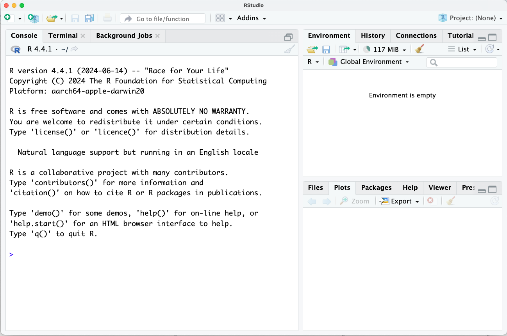
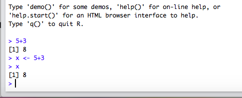
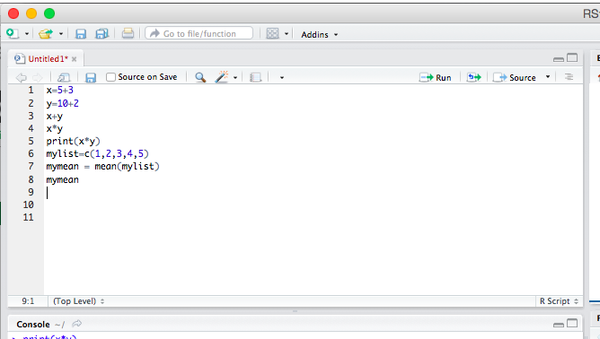
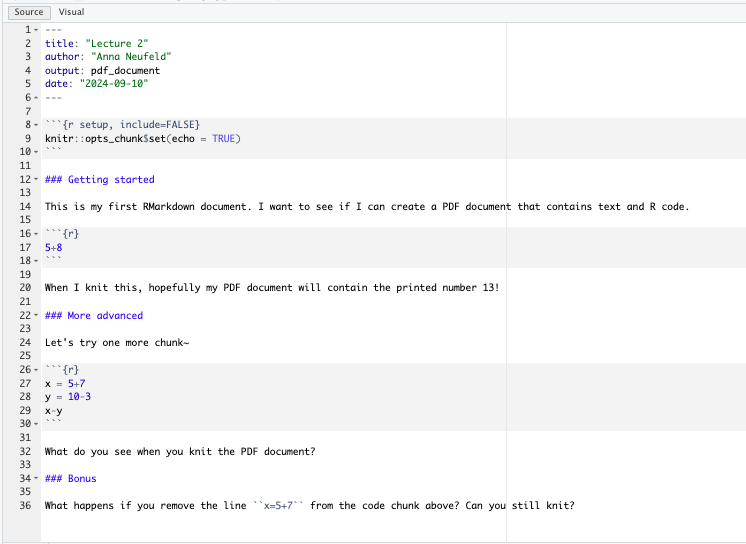
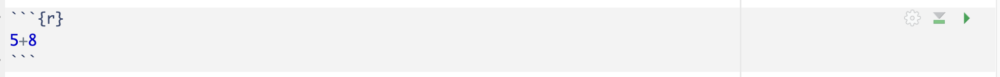
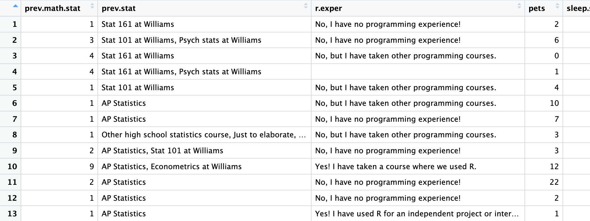

```{r global_options, include=FALSE}
knitr::opts_chunk$set(eval = FALSE)
library(tidyverse)
library(openintro)
```


<div id="boxedtext">

**Learning Objectives**

- Become comfortable with the RStudio interface.
- Understand how to record written explanations and code chunks in an RMarkdown file and ``knit`` the file into a report.
- Run some fun, basic commands in R.
- Load our first dataset into R: use this dataset to review basic concepts about exploratory data analysis. 
</div>

## Why R?

R is an incredibly popular programming language for data analysis. It is used by statisticians but also by scientists in biology, psychology, economics, chemistry, etc. R is fully featured and very powerful, and unlike Stata or SaaS, it is *free and open source*.
This means that you can continue to use it for free after you finish
this class, and beyond. Additionally, R is *extensible*.
When a statistician develops a new method, or when a scientist decides that they need a specific tool to analyze their specific data, they (or someone who wants to use it in R) will often implement the method as a collection of functions in R called a *package*. Other individuals who want to use the method or conduct a similar type of data analysis can download the package and use these functions without needing to rewrite all of the code themselves. The Comprehensive R Archive Network, or **CRAN**, contains over 13,000 [contributed packages](https://cran.r-project.org/web/packages/). 

# Getting Started

Hopefully you were able to download R and RStudio by following the instructions on GLOW. If so, go ahead and launch RStudio. You should see a window that looks like the image 
shown below.


<br>

The panel on the lower left is where the action happens. It's called the *console*. Every time you launch RStudio, it will have the same text at the top of the console telling you the version of R that you're running. Below that information you will see the symbol $>$. This is called the *prompt*: it is a request for a command. Initially, interacting with R is all about typing commands into the console
and interpreting the output. 

The panel in the upper right contains your *environment*, which will show you all of your named variables and datasets once you create/load them. You can also view a *history* of all commands you have previously entered in the console. 

Any plots that you generate will show up in the panel in the lower right corner. This is also where you can browse your files, access help, manage packages, etc.

* * *

### Loading Packages

R is an open-source programming language, meaning that users can contribute
packages that make our lives easier, and we can use them for free. For many labs in the future we will use the following R packages:

- The suite of **tidyverse** packages: for data wrangling and data visualization
- **openintro**: for data and custom functions with the OpenIntro resources
- **tinytex**: you may need this in order to knit an RMarkdown document into a PDF. For example, you need this if you have a Mac and have never installed tex. 

Hopefully you were able to install these packages using ``install.packages()`` using the pre-class instructions. Note that you can check to see which packages (and which versions) are installed by
inspecting the *Packages* tab in the lower right panel of RStudio. If you do not see ``tidyverse``, ``openintro``, and ``tinytex`` in this panel, it means that you need to run the following code from the pre-class instructions. 

```{r install-packages, message = FALSE, eval=FALSE}
install.packages("tidyverse")
install.packages("openintro")
install.packages("tinytex")
tinytex::install_tinytex()
```

Next, regardless of what you completed before class, you need to load these packages in your working environment. We do this with the `library` function. Note that you need to **load** the packages every time you restart RStudio, whereas you only need to **install** the packages once ever. Note that ``tinytex`` is a special case package that we do not need to load: we needed it to make sure we had a Tex installation on our computer, which RMarkdown will need in the background in order to knit to PDFs. 

```{r load-packages, message = FALSE, eval=TRUE}
library(tidyverse)
library(openintro)
```

* * *

### Interacting with R in the Console

The most basic way to interact with RStudio is to use the console as a calculator.  Using the console, you can perform basic arithmetic operations and you can assign values to variables.

Anything that you type after the $>$ (the prompt) will be executed as R code. For example, type ``5+3`` after the prompt and then press enter (return). You should see your answer right away. If instead you type ``x <- 5+3`` and then enter, the console will no longer print out ``8``, but it will save your value of ``x``. Note that ``x`` now appears in your *environment*. Now type ``x`` in the console and hit enter; verify that it prints the appropriate value. 

{width=700px}

# Saving your work

Anything that you could ever want to accomplish in R can be done directly in the console. However, if you are writing commands that you might want to save for later or share with others, it is better to write these inside a file, rather than in the console. For example, if you are working on an assignment, you probably want to be able to access your code again later to check your work.

The most basic type of file is an R Script file. You can create one by going to File, New File, R Scipt. It should show up in the upper left panel of your screen. This file works just like the console, but instead of running a command every time you click enter, you can write several lines at once without running them. If your cursor is on a certain line, clicking "run" in the top right corner will execute just that line. Clicking "source" will execute all lines at once. Experiment by typing code such as the following into your R Script file. Make sure you are comfortable with the difference between running an individual line and running the whole file.  

{width=700px}

* * *

## RMarkdown files

RScript files are great for code, but they are not great for communicating your ideas to others. An RMarkdown file lets you intersperse *chunks* of R code with chunks of text and output the result as a nicely formatted document. For all homework assignments in this course, you will use RMarkdown to create documents that intersperse code with answers to written discussion questions. We will typically post the .Rmd file corresponding to the actual homework assignment, and early in the semester you can use these files as *templates*, where all you need to do is fill in your answers. Later in the semester, for your projects, you will need to be a bit more comfortable formatting your own RMarkdown documents.

For today's tutorial, we will make an RMarkdown document from scratch. In your RStudio application, select File, New File, R Markdown. If prompted, select ``PDF`` as the default output format. Also, if prompted to install any packages, please do so! You will know that you were successful if you end up seeing an example file that looks like this:

{width=900px}

Anything written in this document on plain white background is interpreted as text (write here as you would write in a Microsoft word document), and any code written on gray background is interpreted as R code (write here as you would write in the R console, with one command per line). We call the gray areas **code chunks**. 

Note that, when used on white background, the `#` symbol creates titles and headers that show up in large font in the output document. We use text such as `### Exercise 1` to label the exercises. When used inside of a code chunk, the `#` symbol in R creates a code **comment**.  This can be used to write regular text inside of a code chunk. Any text written in a code chunk after the `#` symbol is ignored; it is not run as R code. We use comments to leave you messages inside of lab and HW templates, such as "write your answer here". 

*Knitting* an RMarkdown document means turning the input file (`.Rmd`) into a nicely formatted output file (`.pdf` in this case). To knit your current template document, select ``knit`` from the buttons at the top of the RMarkdown file. A nicely formatted document will open up in a new window. 

Modify your example document so that it looks something like this one: 

{width=900px}

## Running code in RMarkdown files

You will notice that just typing the code in the gray chunk did not produce any sort of answer for us. To see the answer to this math expression, we need to **run** this code. 


First note that all code in your chunks is automatically run each time you knit your document. Knit your template document now to try this out! Did it print your answer? 

You can knit your R Markdown file every time you write code, but sometimes the knitting process takes a few minutes and you just want to run a few lines at a time to make sure they are working. To run chunks without knitting, you can use either the Run button on the chunk 
(green sideways triangle) or you can highlight the code and click Run on the top right corner of the R Markdown editor. While it is good to run individual chunks to test out ideas and explore, we also strongly recommend that you **knit your document** each time you finish an exercise. The knitting process can sometimes lead to errors. Students often run in to trouble if they wait to try knitting their document until right before the assignment deadline. Knitting after each exercise ensures that you catch errors as you go. 

When an R Markdown document is knitting, it only has access to the variables that are created inside of the R Markdown document itself. The R Markdown document does not get to use the environment in the upper right hand corner of your screen while it is knitting. The R Markdown document only gets to see the variables that are defined inside of the document. 

To illustrate this concept, delete the line ``x <- 5+7`` from your sample document. Can you still run the chunk locally? What happens if you try to knit your document? 

```{r}
y <- 10-3
x-y
```

It is also important in an R Markdown document that all variables are defined in order. You will notice that exercise 5 contains two code chunks in your template. What happens if you add ``x <- 5+7`` back into your sample document, but you add it to its own code chunk. Can you knit the document now? 

* * *

# Loading and cleaning our first dataset

While using R as a calculator was a fun warmup, in this class we are typically going to use R to analyze datasets. With this in mind, we need to learn how to load our dataset into R. There are several ways that we will do this in this class.

+ Many datasets are built into packages. These are extremely easy to load. As long as you have the package installed, you just load the package and then access the relevant dataset with the ``data()`` function. This is what you will be doing on HW1! These are typically datasets that are meant for educational purposes. 
+ We can also load data in from an Excel file or a .csv file. This is probably the way that many of you will load your data for your final projects. You can do this using the ``import dataset`` button, which you will find in the top right corner of your RStudio interface. 
+ Today, we will load our dataset directly from a URL. I sometimes post the dataset on my github website for you to read directly, because this is easier and quicker than uploading/downloading files. But this is sort of contrived because I post it in a really special format: you won't typically be able to do this in the real world. 
+ Sometimes (later in the semester) we will generate our own data! 

At the start of the semester, we will always give you very clear instructions on how to load the required dataset. Eventually, for your projects, you will need to know how to troubleshoot and load the data yourself! 

### Loading the "Getting to Know You" dataset

Over the weekend, 41 Stat 202 students filled out the "getting to know you" survey. Google forms lets me export the survey responses into a google sheet / Excel spreadsheet. I removed the names, pronouns, and email addresses from the spreadsheet, and I also removed the answers to the "free response" questions (e.g. "Why are you taking this class"). I changed the column names for readability. Finally, I saved the resulting spreadsheet as a `.csv`. 

As a very quick interlude on data ethics: I also removed ``year`` at Williams. Since we only have two high school students in the class, the data is hardly anonymous if you include this information! It is always good to think about these things when preparing data to share!

I saved the anonymized data as a `.csv` file. I posted it both on GLOW and on my github website. There are two ways that you can load the data. The easiest is to run this code:

```{r}
form_data <- read.csv("https://anna-neufeld.github.io/stat202_tutorials/Week1/form_data_anonymous.csv")
```

The slightly more cumbersome (but useful!) way involves downloading the .csv document from GLOW and importing it using the ``import dataset`` button. We will go over this later in the semester.

Copy the code above into your RMarkdown document. Run the code, such that you have an object called ``form_data`` in your environment? What happens if you click on this dataset? 

### Manipulating and cleaning this dataset 

<div id="boxedtext">

**Goals:**

- Review the basic language of data analysis. 
- Review some challenges of data cleaning.
- Get exposed to the following functions:
  - `select()`
  - `filter()`
  - `mutate()`
</div>

Click on ``form_data`` in your *environment*. You should see something like this: 



<div id="boxedtext">
**With a neighbor, discuss the following questions:**

- What are the **observational units** in this dataset. How many are there?
- What are some examples of **quantitative variables** in this dataset?
- What are some examples of **categorical variables** in this dataset? 
    - Bonus: are any of these **ordinal variables**? 
- Do you see any issues with the data?
</div>

We are really lucky that we don't have too many issues with our data this semester! 

Last semester, many people added commentary to their numerical answers. For example, these were all answers that I got last semester for "How many pets have you had or have you lived with in your life?" on this survey last semester. 

- "1! My dog Sammy is 8. He's a schnoodle." 
- "more than 25 fish, but no more than 7 at a time."
- "3 dogs. 2 dogs currently "                       
- "2 cats!"

This led to some issues! I wanted this to be a numerical variable, but `R` cannot figure out how to convert the sentence *1! My dog Sammy is 8. He's a schnoodle.* to a number automatically. This meant that we had to spend a lot of time *cleaning* our data. This semester, I specifically asked you to enter the answer as a number, and you all followed the instructions! This really reduced the number of things that we will need to clean, which serves as a nice reminder for me about the importance of survey design!

To see that we had issues with added commentary this year, we can extract the ``pets`` variable from our dataset. There are a few ways to do this. See if you can figure out any differences between these.

```{r}
form_data$pets
form_data[,4]
form_data %>% select(pets)
form_data %>% pull(pets)
```

The function ``select()`` is a key function from the ``tidyverse()`` package that we will be using to extract a subset of *variables* (columns) from a dataset. 

When we want to select a subset of *observations* (rows) from a dataset, we use ``filter()``. The following code displays only the data for students who play a sport at Williams. 

```{r}
form_data %>% filter(sports=="Yes")
```

Suppose that we want to save the data subset above to a new dataset called ``athetes``. We can certainly do that!

```{r}
athletes <- form_data %>% filter(sports=="Yes")
```

One reason that the ``tidyverse()`` set of functions is so nice is because it becomes quite easy to combine functions together. What does the following code do?

```{r}
form_data %>% filter(sports=="Yes") %>% select(pets)
```

And, as a harder question, why doesn't the following code work? 

```{r}
form_data %>% select(pets) %>% filter(sports=="Yes")
```

We do have one chance to do some data cleaning. Let's look at the variable ``favorite.coffee``.

```{r}
form_data$favorite.coffee
```
While it is completely fine that some people do not drink coffee, we probably do not want to treat "n/a", "", and "Don't Drink Coffee" as separate answers. Furthermore, categorical variables with only one category can be a bit hard to work with! Let's use the following code to simplify this variable. 

```{r}
form_data <- form_data %>% mutate(favorite.coffee.clean = ifelse(favorite.coffee %in% c("Tunnel", "Goodrich"), favorite.coffee, "Other"))
```

We used ``mutate`` to make a new variable called ``favorite.coffee.clean``. This variable is equal to ``favorite.coffee`` if ``favorite.coffee`` was equal to ``Tunnel`` or ``Goodrich``, but just stores ``Other`` otherwise. Because we *saved* our mutated dataset back into ``form_data`` (this step is very important!), we can now view our new variable:

```{r}
form_data %>% select(favorite.coffee.clean)
```

I am sure that we will have many more chances to clean data later in the semester!

# Exploratory Data Anlysis

<div id="boxedtext">

**Goals:**

- Review the methods for numerically or visually summarizing different types of variables. 
- Get exposed to the following functions:

  - `group_by()`
  - `summarize()`
  - ``mean()``, ``median()``, ``sd()``, etc. 
  - ``ggplot()``
  - ``geom_histogram()``
  - ``geom_boxplot()``
  - ``geom_point()``
</div>


When we do exploratory data analysis, we want to explore **univariate** summaries of our individual variables. We also want to explore **multivariate** relationships between our variables. We want to do this visually, but we may also want to compute some summary statistics! The type of visual and numerical summary depends on the type of variable! We will dive into some examples below. 

### One quantitative variable

Let's use ``pets,`` which stores the recorded answers to the question "How many pets have you had or have you lived with in your life?".

Your are all familiar with many ways to summarize a single quantitative variable. Most of these ways have really intuitive function names in `R`. The *summarize()* function is a nice way to view multiple numeric summaries such as the mean and the median of a variable at once. What do you notice about the mean number of pets as compared to the median?

```{r}
form_data %>% summarize(mean(pets), median(pets))
```

While the mean and median are measures of *center*, we might also want to see some measures of *spread*. 

```{r}
form_data %>% summarize(mean(pets), median(pets), sd(pets), IQR(pets), max(pets))
```
Note that each of these functions can be used individually without using ``summarize()``. But the main advantage of summarize is again that it lets us view many summaries at once, and also it will be easy to combine with functions like ``filter()`` and ``mutate()``. 

```{r}
mean(form_data$pets)
form_data %>% pull(pets) %>% mean()
```


The best way to visually explore a single quantitative variable is with a *histogram*. There are two ways to make a histogram in `R`. 

```{r}
hist(form_data$pets)
```

In this class, we are going to focus on learning how to visualize and summarize our data using the ``tidyverse`` suite of packages. As part of this, we will be making plots using ``ggplot()``. While at first these may seem unnecessarily complex, they will eventually allow you to make much more interesting and customizable plots than base R. I use ``ggplot()`` for all of my research papers! 

```{r, message=F}
ggplot(data=form_data, aes(x=pets))+geom_histogram()
```

We can already start exploring the numerous ways that ``ggplot()`` lets us customize our plots and make them beautiful. 

```{r, message=F}
ggplot(data=form_data, aes(x=pets))+geom_histogram(bins=10)+
  xlab("How many pets have you lived with in your life?")+
  ggtitle("Stat 202 Survey Responses about Pets")
```
Finally, suppose that you want to visualize the number of pets, but only among athletes at Williams. We can easily use the *filter* function to accomplish this; we just need to modify our ``data`` argument. 

```{r}
ggplot(data=form_data %>% filter(sports=="Yes"), aes(x=pets))+geom_histogram(bins=10)+
  xlab("How many pets have you lived with in your life?")+
  ggtitle("Stat 202 Survey Responses about Pets", "Among Athletes")
```
### One categorical variable

Suppose that we want to explore the variable ``favorite.dining``. This is a categorical variable. 

Summarizing a single categorical variable is sort of boring! We don't have measures of center and spread. The main way that we numerically explore a single categorical variable is by making a table. Try out the following lines of code, which all give the same information. What did you learn about this variable?

```{r}
form_data %>% group_by(favorite.dining) %>% summarize(n())
table(form_data$favorite.dining)
form_data %>% select(favorite.dining) %>% table()
```

If we wanted to visually explore a single categorical variable, we would typically use a bar chart. This displays the same information as the table.

```{r}
ggplot(data=form_data, aes(x=favorite.dining))+geom_bar()
```

### One quantitative variable, one categorical variable. 

Data analysis gets more interesting when we start looking at the relationship between two or more variables. We need methods for numerically or visually summarizing the relationships between variables. Our methods will depend on what type of variables we are working with. To start, suppose that we are working with one quantitative variable and one categorical variable.

For example, suppose that we want to study the relationship between the number of cups of coffee that someone drinks per week and whether or not they play a sport at Williams. The best way to do this numerically is by using ``group_by`` and then ``summarize``. 

```{r}
form_data %>% group_by(sports) %>% summarize(mean(cups.coffee), median(cups.coffee), sd(cups.coffee), n())
```

Note that this one person who answered both ``Yes`` and ``No`` to the question of whether or not they play a sport at Williams is a bit of an oddity. At the risk of throwing out valuable data, I am going to remove them from the dataset! I can do this using ``filter()``.

```{r}
form_data_clean <- form_data %>% filter(sports=="Yes" | sports=="No")
```

This takes our dataset and keeps only those who answered a simple "Yes" or "No" to the sports question. It then saves the filtered dataset back to a new dataset called ``form_data_clean``. This is nice, because at least we know that our original dataset is not gone forever. 

We can now redo our summary table. 

```{r}
form_data_clean %>% group_by(sports) %>% summarize(mean(cups.coffee), median(cups.coffee), sd(cups.coffee), n())
```

Based on this table, it does not seem like there is much of a relationship between the amount of coffee that someone drinks and whether or not they play a sport. Eventually in this class, we will review statistical tools that will let us say more formally whether or not there seems to be a relationship between these variables. For now, we are just exploring and looking for patterns. 

My favorite way to visually explore the relationship between one categorical variable and one quantitative variable is with side-by-side boxplots. The following code produces side-by-side boxplots with ``ggplot``. This boxplot again shows that there is likely no relationship between sports and cups of coffee. 

```{r}
ggplot(data=form_data_clean, aes(x=sports, y=cups.coffee))+geom_boxplot()
```
<div id="boxedtext">
**On your own: ** Can you find a categorical variable and a quantitative variable in this dataset that *do* seem to be related to one another? If so, what are they?
</div>

### Two quantitative variables 

When we want to look at the relationship between two quantitative variables, we can use a scatterplot. We will be using a lot of scatterplots later this semester! What do you notice about the relationship below?

```{r}
ggplot(data=form_data, aes(x=sleep.semester, y=cups.coffee))+geom_point()+ylab("Average cups of coffee per week")+xlab("Average hours of sleep per night during semester")+ggtitle("Coffee vs. Sleep")+theme_bw()
```

When we want to numerically summarize the relationship between two quantitative variables, we use correlation. According to the correlation, there is a weak negative relationship between these two variables. We will cover correlation in more depth later in the semester!

```{r}
cor(form_data$sleep.semester, form_data$cups.coffee)
```

### Two categorical variables

In this final section, we will look at the relationship between a student's favorite dining hall and what side of route 2 they live on. Both of these variables are categorical. What do you notice from the following table?

```{r}
form_data %>% select(route2.side, favorite.dining) %>% table()
```

Two-way tables are a great way to summarize the relationship between two categorical variables. But there are actually a lot of subtle things that we need to remember from intro stats. For example, if we want to turn the counts in the table above into percentages, we actually have a lot of choices about how to do this. 

Consider the three tables below. Can you figure out what each one is telling you? How do they differ? Which are most useful for studying the relationhip between these two variables?

```{r}
form_data %>% select(route2.side, favorite.dining) %>% table() %>% prop.table()
form_data %>% select(route2.side, favorite.dining) %>% table() %>% prop.table(margin=1)
form_data %>% select(route2.side, favorite.dining) %>% table() %>% prop.table(margin=2)
```


Each of the tables above also has a corresponding visual that we can make. You will practice interpreting these tables and plots on HW2. For now, consider the plot below to be a preview of what is to come. How would you interpret this?

```{r}
ggplot(data=form_data, aes(x=route2.side, fill=favorite.dining))+geom_bar(position="stack")
```

Based on the summaries above, do you think that there is a meaningful relationship between a students' favorite dining hall and what side of route 2 they live on? Discuss with your group!

# Wrap up

Hopefully, when you work on HW1, you will find that I went over all of the R functions that you need for the homework in class. It is my goal that this will be the case for every homework throughout the semester! 

If you are already experienced in programming, I would encourage you to go above-and-beyond on the homework assignments in terms of making your code and your plots beautiful. If you are new to programming, please let me know if the pacing seems too fast for you! I am happy to provide additional resources for learning R if needed! 


*** 
## Acknowledgements

The formatting and some of the introductory content in this tutorial was adopted from an OpenIntro lab.

<div id="license">
This is a product of OpenIntro that is released under a 
[Creative Commons Attribution-ShareAlike 3.0 Unported](http://creativecommons.org/licenses/by-sa/3.0). 
This lab was adapted for OpenIntro by Andrew Bray and Mine &Ccedil;etinkaya-Rundel
from a lab written by Mark Hansen of UCLA Statistics.
</div>

