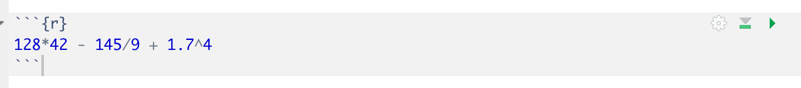

```{r global_options, include=FALSE}
knitr::opts_chunk$set(eval = FALSE)
library(tidyverse)
library(openintro)
```


<div id="boxedtext">

**Learning Objectives**

- Become comfortable with the RStudio interface.
- Understand how to record written explanations and code chunks in an RMarkdown file and ``knit`` the file into a report.
- Run some fun, basic commands in R.
- Load our first dataset into R: use this to review basic concepts about datasets. 
</div>

## Why R?

R is an incredibly popular programming language for data analysis; used by statisticians but also by scientists in biology, psychology, economics, chemistry, etc. R is fully featured and very powerful, and unlike Stata or SaaS, it is *free and open source*.
This means that you can continue to use it for free after you finish
this class, and beyond. Additionally, R is *extensible*.
When a statistician develops a new method, or when a scientist decides that they need a specific tool to analyze their specific data, they (or someone who wants to use it in R) will often implement the method as a collection of functions in R called a *package*. Other individuals who want to use the method or conduct a similar type of data analysis can download the package and use these functions without needing to rewrite all of the code themselves. The Comprehensive R Archive Network, or **CRAN**, contains over 13,000 [contributed packages](https://cran.r-project.org/web/packages/). 

## Getting Started

Hopefully you were able to download R and RStudio by following the instructions on GLOW. If so, go ahead and launch RStudio. You should see a window that looks like the image 
shown below.


<br>

The panel on the lower left is where the action happens. It's called the *console*. Everytime you launch RStudio, it will have the same text at the top of the console telling you the version of R that you're running. Below that information you will see the symbol $>$. This is called the *prompt*: it is a request for a command. Initially, interacting with R is all about typing commands into the console
and interpreting the output. 

The panel in the upper right contains your *environment*, which will show you all of your named variables and datasets once you create/load them. You can also view a *history* of all commands you have previously entered in the console. 

Any plots that you generate will show up in the panel in the lower right corner. This is also where you can browse your files, access help, manage packages, etc.

* * *

### Loading Packages

R is an open-source programming language, meaning that users can contribute
packages that make our lives easier, and we can use them for free. For many labs in the future we will use the following R packages:

- The suite of **tidyverse** packages: for data wrangling and data visualization
- **openintro**: for data and custom functions with the OpenIntro resources
- **tinytex**: you may need this in order to knit an RMarkdown document into a PDF. For example, you need this if you have a Mac and have never installed tex. 

Hopefully you were able to install these packages using ``install.packages()`` using the pre-class instructions. Note that you can check to see which packages (and which versions) are installed by
inspecting the *Packages* tab in the lower right panel of RStudio. If you do not see ``tidyverse``, ``openintro``, and ``tinytex`` in this panel, it means that you need to run the following code from the pre-class instructions. 

```{r install-packages, message = FALSE, eval=FALSE}
install.packages("tidyverse")
install.packages("openintro")
install.packages("tinytex")
tinytex::install_tinytex()
```

If you already ran this before class, you likely do not need to run it again. 

Next, you need to load these packages in your working environment. We do this with the `library` function. Note that you need to **load** the packages every time you restart RStudio, whereas you only need to **install** the packages once ever. Note that tinytex is a special case package that we do not need to load: we needed it to make sure we had a Tex installation on our computer, which RMarkdown will need in the background in order to knit to PDFs. 

```{r load-packages, message = FALSE, eval=TRUE}
library(tidyverse)
library(openintro)
```

* * *

### Interacting with R in the Console

The most basic way to interact with RStudio is to use the console as a calculator.  Using the console, you can perform basic arithmetic operations and you can assign values to variables.

Anything that you type after the $>$ (the prompt) will be executed as R code. For example, type ``5+3`` after the prompt and then press enter (return). You should see your answer right away. If instead you type ``x <- 5+3`` and then enter, the console will no longer print out ``8``, but it will save your value of ``x``. Note that ``x`` now appears in your *environment*. Now type ``x`` in the console and hit enter; verify that it prints the appropriate value. 


# Saving your work

Anything that you could ever want to accomplish in R can be done directly in the console. However, if you are writing commands that you might want to save for later or share with others, it is better to write these inside a file, rather than in the console. For example, if you are working on an assignment, you probably want to be able to access your code again later to check your work.

The most basic type of file is an R Script file. You can create one by going to File, New File, R Scipt. It should show up in the upper left panel of your screen. This file works just like the console, but instead of running a command every time you click enter, you can write several lines at once without running them. If your cursor is on a certain line, clicking "run" in the top right corner will execute just that line. Clicking "source" will execute all lines at once. Experiment by typing code such as the following into your R Script file. Make sure you are comfortable with the difference between running an individual line and running the whole file.  


* * *

## RMarkdown files

RScript files are great for code, but they are not great for communicating your ideas to others. An RMarkdown file lets you intersperse *chunks* of R code with chunks of text and output the result as a nicely formatted document. For all homework assignments in this course, you will use RMarkdown to create documents that intersperse code with answers to written discussion questions. We will typically post the .Rmd file corresponding to the actual homework assignment, and early in the semester you can use these files as *templates*, where all you need to do is fill in your answers. 

For this exercise, we will make an RMarkdown document from scratch. **Give instructions on opening this**. 

Anything written in this document on plain white background is interpretted as text (write here as you would write in a microsoft word document), and any code written on gray background is interpreted as R code (write here as you would write in the R console, with one command per line). We call the gray areas **code chunks**. 

*Knitting* an RMarkdown document means turning the input file (`.Rmd`) into a nicely formatted output file (`.html` in this case). To knit your current template document, select ``knit`` from the buttons at the top of the RMarkdown file. A nicely formatted document will open up in a new window. 

Note that, when used on white background, the `#` symbol creates titles and headers that show up in large font in the output document. We use text such as `### Exercise 1` to label the exercises. When used inside of a code chunk, the `#` symbol in R creates a code **comment**.  This can be used to write regular text inside of a code chunk. Any text written in a code chunk after the `#` symbol is ignored; it is not run as R code. We use comments to leave you messages inside of lab and HW templates, such as "write your answer here". 

### Running code in RMarkdown files

You will see that the example RMarkdown file also has an example R chunk! Delete the code that is already there, and replace it with the following code: 


You will notice that just typing the code in the gray chunk did not produce any sort of answer for us. To see the answer to this math expression, we need to **run** this code. 

First note that all code in your chunks is automatically run each time you knit your document. Knit your template document now to try this out! Did it print your answer? 

You can knit your R Markdown file every time you write code, but sometimes the knitting process takes a few minutes and you just want to run a few lines at a time to make sure they are working. To run chunks without knitting, you can use either the Run button on the chunk 
(green sideways triangle) or you can highlight the code and click Run on the top right corner of the R Markdown editor. While it is good to run individual chunks to test out ideas and explore, we also strongly recommend that you **knit your document** each time you finish an exercise. The knitting process can sometimes lead to errors. Students often run in to trouble if they wait to try knitting their document until right before the assignment deadline. Kniting after each exercise ensures that you catch errors as you go. 

* * *

## Knitting vs. running locally 

**Have them practice the idea that variables that they have access to locally cannot be accessed upon knitting !!! This is so important.**

Note that, for this exercise, you will need the special symbol `<-`. The symbol `<-` performs an *assignment*, taking the output of one line of code and saving it into an object in your environment. 

When an R Markdown document is knitting, it only has access to the variables that are created inside of the R Markdown document itself. The R Markdown document does not get to use the environment in the upper right hand corner of your screen while it is knitting. The R Markdown document only gets to see the variables that are defined inside of the document. To illustrate this concept, run the following three lines of code in your **console**.

```{r}
z <- 12
y <- 17
z - y
```


The lines should work fine, and -5 should be printed. Now, try putting the code `z-y` into a code chunk in your R Markdown document, and try to knit the document. What happened? Why did this happen? Discuss as a group.  

It is also important in an R Markdown document that all variables are defined in order. You will notice that exercise 5 contains two code chunks in your template. What happens if you put ``x-y`` in the first code chunk and you put ``z <- 12`` and ``y <- 17`` in the second code chunk? Try knitting the document. What happens? Why? 

* * *

# Loading our first dataset

While using R as a calculator was a fun warmup, in this class we are typically going to use R to analyze datasets. With this in mind, we need to learn how to load our dataset into R. There are several ways that we will do this in this class.

+ Many datasets are built into packages. These are extremely easy to load; you just load the package. 
+ Sometimes I will give you instructions to download a dataset from the web.
+ Sometimes we will load data in from an Excel file or a .csv file or something. This is the most common!
+ Sometimes (later in the semester) we will generate our own data! 

At the start of the semester, we will always give you very clear instructions on how to load the required dataset. For your projects, you are going to need to figure it out for yourself (but of course, we are here to help!). 


## Additional Practice

Variables in R can be more than just numbers! If there is time left in section, play around with the following lines of code in your console. You do not need to turn anything in for this part of the assignment, and if you don't get to it during section you do not need to worry about it. 

First, let's explore what happens when we work with text in R. Does it make sense to add two variables when they are not numbers? Discuss!

```{r, eval=FALSE}
x <- "cat"
y <- "dog"
x*y
```

In statistics, we often are not working with one number at a time. We are often working with lists of numbers; datasets! We can make our first small dataset in R using the `c()` function, which binds elements together in a list. Discuss the following lines of code as a group.

```{r, eval=FALSE}
data <- c(1,5,7,8,9,10,12,13)
mean(data)
data+5
mean(data+5)
data[3]
```

*** 

## Conclusion

Today, we perfomed some basic calculations in R. The primary purpose was to give you practice making and knitting an RMarkdown document. Next week, we will start working with real datasets in R using the **tidyverse** packages. 

## Acknowledgements

Much of the content in this tutorial was adopted from an OpenIntro lab. <div id="license">
This is a product of OpenIntro that is released under a 
[Creative Commons Attribution-ShareAlike 3.0 Unported](http://creativecommons.org/licenses/by-sa/3.0). 
This lab was adapted for OpenIntro by Andrew Bray and Mine &Ccedil;etinkaya-Rundel
from a lab written by Mark Hansen of UCLA Statistics.
</div>

This tutorial uses the OpenIntro formatting template.
