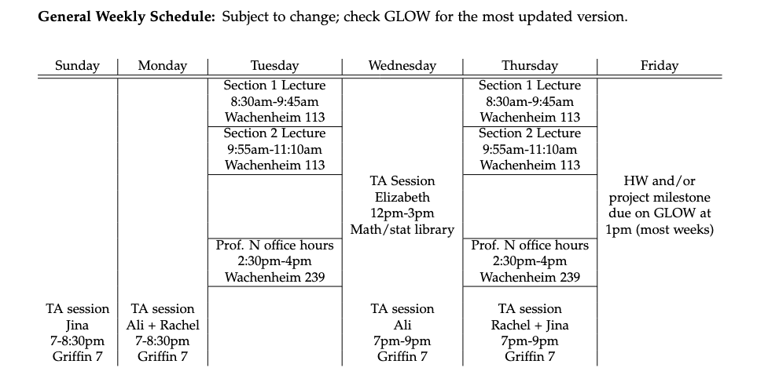
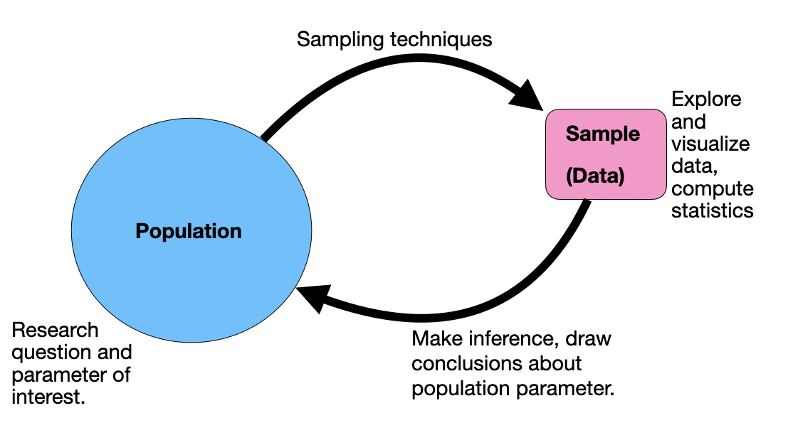

```{r setup, echo=FALSE, include=FALSE}
knitr::opts_chunk$set(echo = FALSE, tidy=TRUE, message=FALSE)
library(tidyverse)
library(patchwork)
```

## Announcements



- Additional office hours: I will often be in my office from 1pm-2:30pm on Thursdays, and from 2pm-3pm on Wednesdays.

## Announcements

- HW1 due Friday on GLOW at 1pm.
- Keep thinking about datasets and groupmates for the project:
    - First milestone is due Friday, 9/27.
    - You can start working on this milestone alone or with groupmates.
    - Example final projects [that won national prizes](https://www.causeweb.org/usproc/usclap/2023/fall/winners) posted on GLOW.
- Stat kick-off colloquium:
    - Wednesday 9/18 at 1pm, NSB 015
    - Ville Satopaa `11

## Overview

- **Today:** Exploratory data analysis in R!
- **Thursday:** More of the same
- **Next week:** Sampling and random variables!

## Where are we?

{width=400px}

## Where are we?

{width=400px}

## Key words

- Observational unit
- Variable
  - Quantitative
      - Discrete, continuous.
  - Categorical:
      - Ordinal
  - Other types?
- Univariate? Multivariate? 
- Response vs. predictor
  
## A single quantitiative variable

- How do we explore visually?

- How do we summarize numerically?

- What should we be thinking about?


## A single quantitiative variable

```{r, echo=F}
dat1 <- rnorm(200, mean=10, sd=1)
dat2 <- runif(200, min=0, max=20)
dat3 <- rbinom(200, size=20, prob=0.05)
dat4 <- c(rnorm(195, mean=5, sd=1), 17,17,18,21,22)
```

```{r, warning=F, message=F}
p1 <- ggplot(data=NULL, aes(x=dat1))+geom_histogram(bins=20)+
  ggtitle("")+xlab("Variable 1")
p2 <- ggplot(data=NULL, aes(x=dat2))+geom_histogram(bins=20)+
  ggtitle("")+xlab("Variable 2")
p3 <- ggplot(data=NULL, aes(x=dat3))+geom_histogram(bins=20)+
  ggtitle("")+xlab("Variable 3")
p4 <- ggplot(data=NULL, aes(x=dat4))+geom_histogram(bins=20)+
  ggtitle("")+xlab("Variable 4")
```

```{r, out.width="80%", warning=F, message=F}
p1+p2+p3+p4+plot_layout(nrow=2) & xlim(0,20)
```


>- We think about SOCS (shape, outliers, center, spread).
>- Numerical summaries: mean, median, mode, sd, IQR.

## Quantitative response, categorical predictor

- How do we explore visually?

- How do we summarize numerically?

- What should we be thinking about?

## Quantitative response, categorical predictor

**Anna to add: side by side boxplots. Maybe two types. SOCS still important. All the same summaries, just by group**. 

## Quantitative response, quantitative predictor

- How do we explore visually?

- How do we summarize numerically?

- What should we be thinking about?

## Quantitative response, quantitative predictor


**Anna to add: scatterplots. side by side boxplots. Maybe two types. SOCS still important. All the same summaries, just by group**.

## Single categorical variable

- How do we explore visually?

- How do we summarize numerically?

- What should we be thinking about?

## Single categorical variable

- **Insert table and bar plot.**


## Categorical response, categorical predictor

 
## Categorical response, quantitative predictor


---

