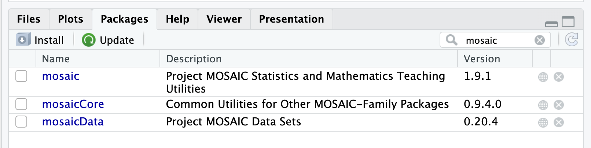

```{r global_options, include=FALSE}
knitr::opts_chunk$set(eval = FALSE)
library(tidyverse)
library(openintro)
```


<div id="boxedtext">

**Learning Objectives**

- Become more comfortable with the RStudio interface.
- Load and explore a dataset in an RMarkdown file.
- Review methods for visually and numerically summarizing different types of variables. 

</div>

# Getting Started

Please open up RStudio so that you see the following window. 


For today's tutorial, I am going to work in an R Script file instead of an RMarkdown file. This is because I realized it is easier for you all to see what I am doing on the projector screen when I don't have different chunks of code floating around! Also, today is all about exploratory data analysis. R Script files are really great for exploring! RMarkdown files are important when we are done exploring and need to actually *communicate* our results. 

With this in mind, please open up an RScript file! As a reminder, you can do this by going to File, New File, R Script. A new blank white file should show up in the upper left panel of your screen. As a reminder, this file works just like the console, but instead of running a command every time you click enter, you can write several lines at once without running them. If your cursor is on a certain line, clicking "run" in the top right corner will execute just that line. Clicking "source" will execute all lines at once. Experiment by typing code such as the following into your R Script file. Make sure you are comfortable with the difference between running an individual line and running the whole file.  

{width=700px}

* * *

# Loading the dataset

Today, we will work with a dataset about prices of houses that were sold in Saratoga County, New York in 2006. These data were collected by a Williams student (Candice Corvetti) for her senior thesis in 2007! 

This dataset is built into the ``mosaic`` R package. The easiest way to load this dataset is to install and load this package. First, check to see if you have ``mosaic`` already installed in your packages tab. 

{width=500px}

If not, run the following command in your console:

```{r, eval=F}
install.packages("mosaic")
```

Once you have done this, load the package and the dataset using the following code.

```{r, eval=T, message=F, warning=F}
library(mosaic)
data("SaratogaHouses")
```

Just in case you are unable to load the package, you can also download the data from my github website using the following code. But loading directly from the package is preferable. 

```{r, eval=F}
SaratogaHouses <- read.csv("https://anna-neufeld.github.io/stat202_tutorials/Week1/SaratogaHouses.csv", row.names=1)
```

Once you have the data loaded, you can view the first few lines of the data using the following command.

```{r, eval=T}
head(SaratogaHouses)
```
<div id="boxedtext">
**With a neighbor discuss the following:**

- What are the observational units in this dataset? How many are there?
- How many variables are in the dataset? 
    - For each one, is it quantitative or categorical? 

</div>


# Exploratory Data Analysis

Today's tutorial is all about how we explore different types of variables and the relationship between them! We will go through different cases in order. Before we start, we need to be sure to load the tidyverse!

```{r, eval=T}
library(tidyverse)
```

### One quantitative variable

Let's first focus on ``price``. There are a bunch of different ways to extract the ``price`` variable from the dataset. Try running the following lines of code. What do you notice?

```{r, eval=F}
price
SaratogaHouses$price
SaratogaHouses %>% select(price)
SaratogaHouses %>% pull(price)
names(SaratogaHouses)
SaratogaHouses[,1]
```

We can view all sorts of numerical summaries of this variable. Try running the following lines of code. What do you notice?

```{r}
summary(SaratogaHouses$price)
SaratogaHouses %>% pull(price) %>% summary()
mean(SaratogaHouses$price)
median(SaratogaHouses$price)
max(SaratogaHouses$price)
IQR(SaratogaHouses$price)
sd(SaratogaHouses$price)
SaratogaHouses %>% summarize(mean(price), max(price), IQR(price))
```

While numerical summaries are great, it is always important to look at our data visually! For a single quantitative variable, we might be interested in making a histogram. Try out the following code! 

```{r, eval=T, warning=F, message=F}
ggplot(data=SaratogaHouses, aes(x=price))+geom_histogram()
```

<div id="boxedtext">
**Whenever we describe a quantitative variable, we want to describe all the elements of SOCS**

- Shape
- Outliers
- Center 
- Spread

</div>

Play around with the plot above. Can you make it more beautiful? Explore changing the number of bins, changing the title, changing the axis labels, etc. 

```{r, eval=T}
ggplot(data=SaratogaHouses, aes(x=price))+
  geom_histogram(bins=50)+
  ggtitle("Prices of homes in Saratoga County")+
  xlab("Price")+ylab("Count")+
  theme(axis.title=element_text(size=30), plot.title=element_text(size=20))+
  theme_bw()
```


### One quantitative variable, one categorical variable

Now suppose that we want to examine the relationship between ``price`` and a categorical variable such as ``newConstruction``. For example, maybe we want to know if new houses tend to cost more. 

In terms of numerical summaries, we are usually interested in the same summaries as above, but not we want to report them within each category. Try out the following code.

```{r, eval=T}
SaratogaHouses %>% group_by(newConstruction) %>% summarize(mean(price), median(price), n())
```

**Optional:** Someone in office hours asked how we can make our summary tables print more beautifully in RMarkdown. If you would like beautiful tables, try out the following code:

```{r, eval=F}
install.packages("kableExtra")
```

```{r, eval=T, message=F, warning=F}
library(kableExtra)
SaratogaHouses %>% 
  group_by(newConstruction) %>% 
  summarize("Mean"= mean(price), "Median" = median(price), "n"= n()) %>% 
  kbl() %>% 
  kable_classic()
```

To visually display the relationship between a quantitative variable and a categorical variable, we often want to make side by side boxplots. Another option is multiple histograms. Basically, we can do anything that we would do for a single quantitative variable, we just compare across groups!

```{r, eval=T}
ggplot(data=SaratogaHouses, aes(x=newConstruction, y=price))+geom_boxplot()
```

<div id="boxedtext">
**What do you notice? How would you compare these distributions in terms of SOCS?**
</div>

As an alternative to side by side boxplots, we can make multiple histograms. There are several ways to do this. Please explore on your own time!
```{r, eval=T, message=F, warning=F}
ggplot(data=SaratogaHouses, aes(x=price, fill=newConstruction))+
  geom_histogram()
ggplot(data=SaratogaHouses, aes(x=price, fill=newConstruction))+
  geom_histogram(alpha=0.5, position="identity")
ggplot(data=SaratogaHouses, aes(x=price))+
  geom_histogram()+facet_grid(vars(newConstruction))
```

### Two quantitiatve variables. 

### One quantitative variable

Let's use ``pets,`` which stores the recorded answers to the question "How many pets have you had or have you lived with in your life?".


```{r}
form_data_clean$year
form_data_clean$year=="Senior"
form_data_clean %>% filter(year=="Senior")
```
Subsetting our histogram to only include seniors is simple: we just modify the ``data`` argument so that it calls upon the filtered dataset. 


```{r}
form_data_clean %>% group_by(year) %>% summarize(mean(pets_numeric))
```

*Ordinal* variables are categorical variables that have a natural ordering to them. When we have an ordinal variable, it is nice to tell `R` this so that the categories will be displayed in order. Try running the following code:

```{r}
form_data_clean <- form_data_clean %>% 
    mutate(year = ordered(year, levels=c("First year", "Sophomore", "Junior", "Senior")))
```

And now try remaking the table from above.

```{r}
form_data_clean %>% group_by(year) %>% summarize(mean(pets_numeric))
```
What do you notice? What improved? What did not improve? Does there seem to a relationship between the number of pets and the year at Williams? 

Eventually in this class, we will review statistical tools that will let us say more formally whether or not there seems to be a relationship between these variables. For now, we might want to just look informally at a bit more information:

```{r}
form_data_clean %>% group_by(year) %>% summarize(mean(pets_numeric), median(pets_numeric), sd(pets_numeric), n())
```

My favorite way to visually explore the relationship between one categorical variable and one quantitative variable is with side-by-side boxplots. The following code produces side-by-side boxplots with ``ggplot``. What do you notice about the relationship?

```{r}
ggplot(data=form_data_clean, aes(x=year, y=pets_numeric))+geom_boxplot()
```

### Two categorical variables

In this final section, we will look at the relationship between a student's favorite dining hall and whether or not they play a sport at Williams. Both of these variables are categorical. 

Let's first look at the variable ``sports``. Note that I am going to work with ``form_data``, not ``form_data_clean``, because I no longer need to worry about the ``pets`` variable. 

```{r}
form_data %>% group_by(sports) %>% summarize(n())
```

While "No" and "Yes" probably seem like very reasonable values for this variable, it turns out that it is really convenient in `R` if our ``binary`` variables are stored as `0` and `1`. We use `1` to represent `TRUE` and `0` to represent `FALSE`. We can use *mutate()* to make a new variable called ``athlete``, which evaluates to `TRUE` when ``sports=="Yes"`` and evaluates to false otherwise. 

```{r}
form_data <- form_data %>% mutate(athlete = sports=="Yes")
```

The reason that this is convenient is that we can now do the following. Discuss the meaning of these numbers with your neighbors! 

```{r}
form_data %>% summarize(sum(athlete), mean(athlete))
```

Now that we have this new ``athlete`` variable, it is seamless to look at the proportion of students who are athletes, broken down by a student's favorite dining hall. 

```{r}
form_data %>% group_by(dining_hall) %>% summarize(mean(athlete))
```

We can also make a visual representation of this data. 

```{r}
ggplot(data=form_data, aes(x=dining_hall, fill=athlete))+geom_bar(position="dodge")
```

Based on the summaries above, do you think that there is a meaningful relationship between a students' favorite dining hall and whether or not they play a sport at Williams? Discuss with your group! 

# Wrap up

Hopefully, when you work on HW1, you will find that I went over all of the R functions that you need for the homework in class. It is my goal that this will be the case for every homework throughout the semester! 

If you are already experienced in programming, I would encourage you to go above-and-beyond on the homework assignments in terms of making your code and your plots beautiful. If you are new to programming, please let me know if the pacing seems too fast for you! I am happy to provide additional resources for learning R if needed! 


*** 
## Acknowledgements

The formatting of this tutorial was adopted from an OpenIntro lab. <div id="license">
This is a product of OpenIntro that is released under a 
[Creative Commons Attribution-ShareAlike 3.0 Unported](http://creativecommons.org/licenses/by-sa/3.0). 
</div>

